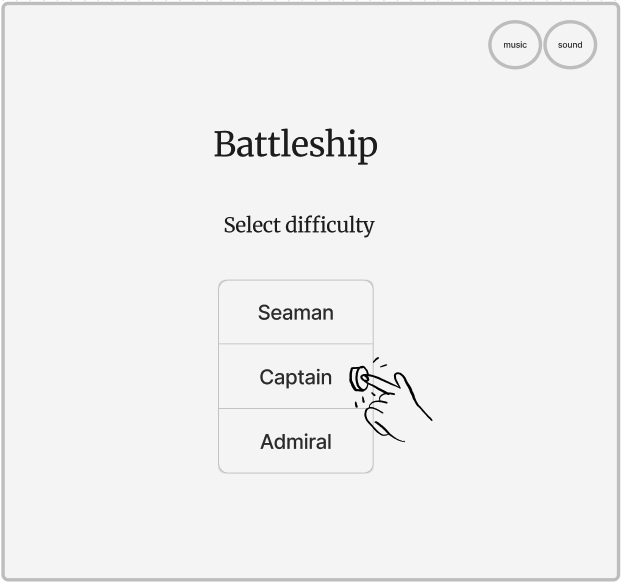
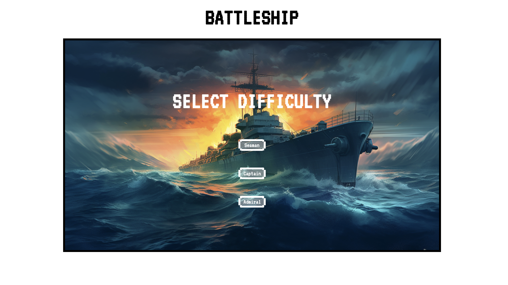
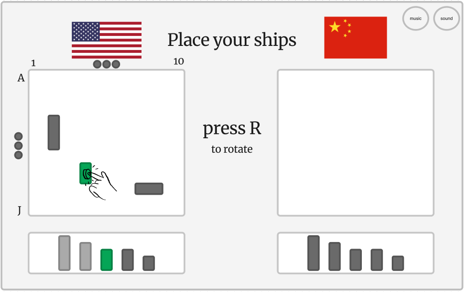
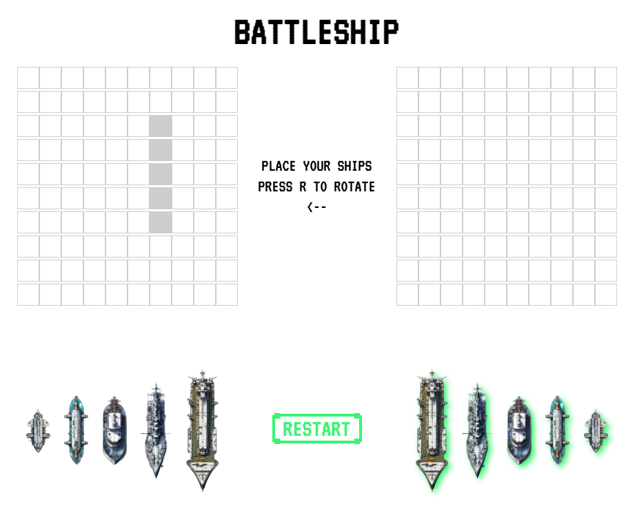
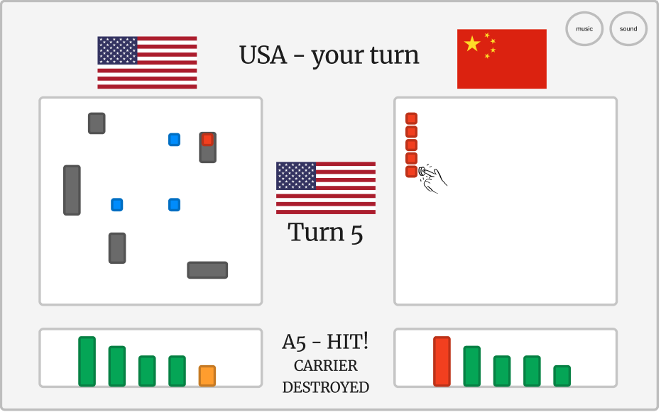
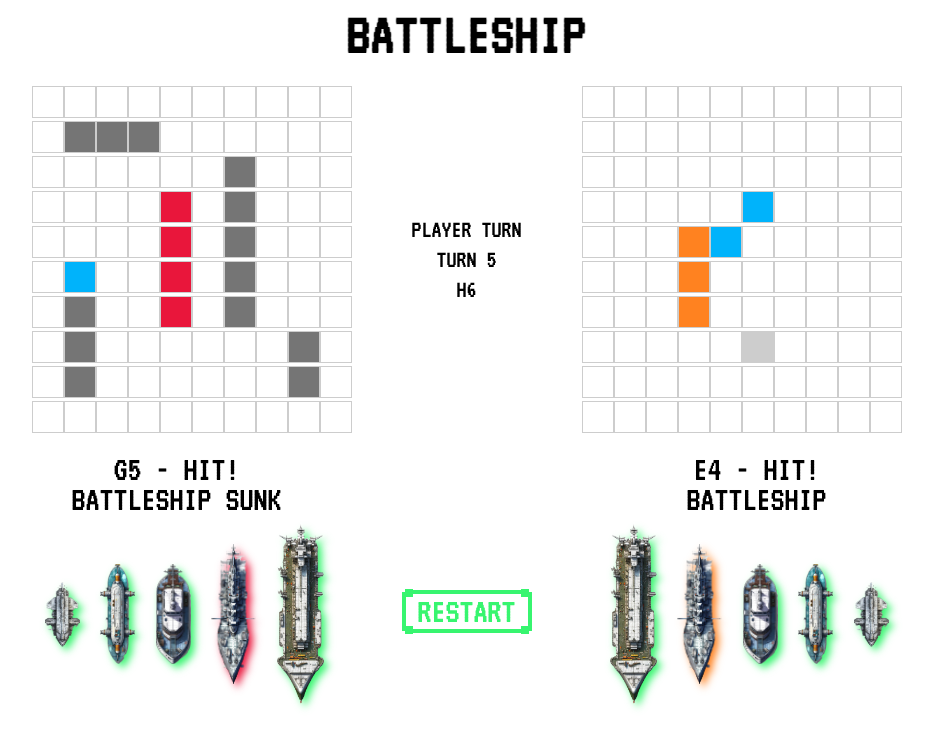
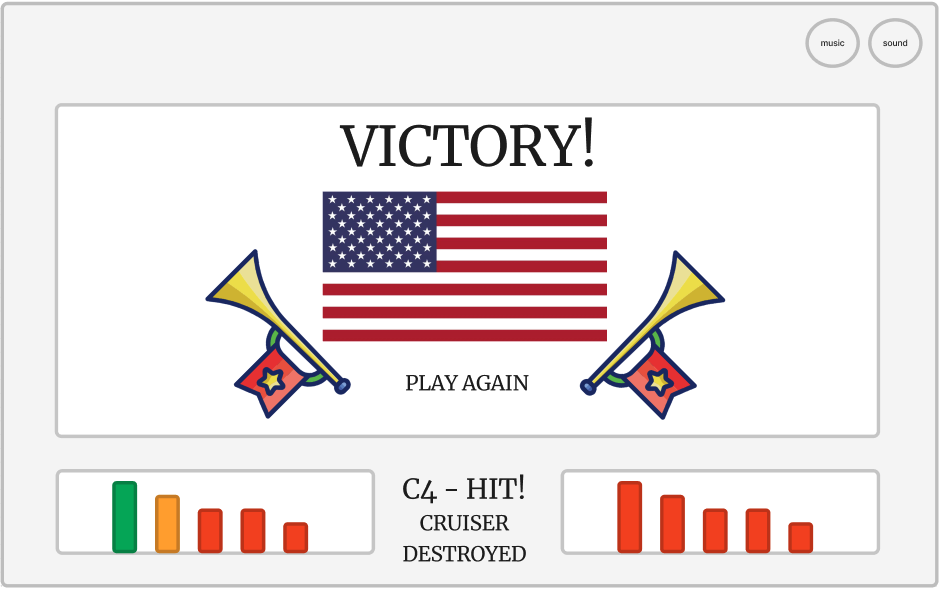
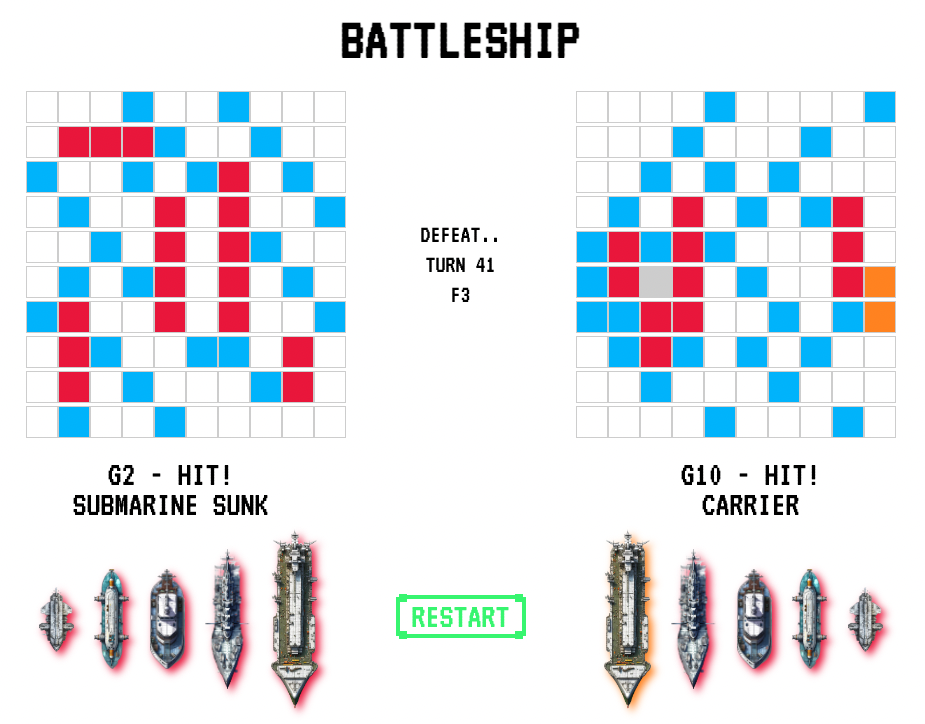
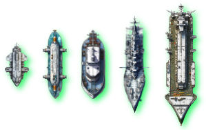
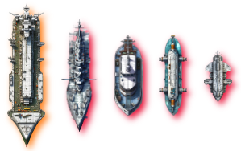

# Battleship
## Description
This project was the first one completed as part of the General Assembly SEI Bootcamp. The goal of the project was to use vanilla JavaScript, HTML and CSS to create a browser game. The game I chose was Battleship, as I had enjoyed playing it when I was young, and implementing a human-like AI to play against presented an interesting challenge.

## Deployment link
The project is hosted <a href="https://andy-ag.github.io/Battleship/" target="_blank" rel="noopener noreferrer">here</a>.


## Code Installation & Setup Guide

1. **Clone the Repository**  
   Firstly, you need to clone the repository to your local machine. Open your terminal and run:  
   `git clone https://github.com/andy-ag/Battleship.git`  

2. **Navigate to the Project Directory**  
   `cd Battleship`  

3. **Serve the Game Locally**  
   If you have Python installed on your machine (most systems have it pre-installed), you can start a simple HTTP server:  
   - For Python 2.x:  
     `python -m SimpleHTTPServer`  
   - For Python 3.x:  
     `python -m http.server`  
   This will start a local server on port `8000`. If you want to specify a different port, you can add it after the command, like `python -m http.server 8080`.

4. **Open the Game in Your Browser**  
   Once the server is running, open your browser and go to:  
   `http://localhost:8000`  
   You should see the game running!

5. **Enjoy!**  
   Play the game and have fun. If you encounter any issues, please report them on the GitHub repository.

## Timeframe and Working Team
A week was initially budgeted for the completion of the project, but due to government holidays in the UK the timeframe was reduced to 5 days. It was a project that I worked on independently.

## Technologies Used
The game was built using only vanilla JavaScript, HTML and CSS, as per the project requirements. I used Visual Studio Code to produce the code, and Figma to create the initial wireframes.

## Brief

The brief for the game was as follows:

Create a browser game using vanilla JavaScript, HTML, and CSS. 
The game **must**:
  - Render a game in the browser
  - Include win/loss logic and render win/loss messages in HTML
  - Include separate HTML, CSS, and JavaScript files
  - Have properly indented HTML, CSS, and JavaScript with consistent vertical whitespace
  - Have no remaining unused or commented out code
  - Have sensible function and variable names
  - Be coded in a consistent manner
  - Be deployed online using GitHub pages

In addition, before starting work on the game, a wireframe and basic pseudocode for the gameplay had to be presented and approved.

## Planning 
As a first action, I sketched out an initial wireframe for the UI and sequential gameplay process. Ultimately, I ended up deviating from both the feature set and the original aesthetic concept slightly. Due to the short timeframes, I felt that I would not have sufficient time to implement the retro-game design for it to feel satisfactory, and opted instead for a clean, minimalistic look. I am quite happy with how this decision panned out, as I was able to produce a game that looks more finished, polished, and coherent aesthetically.

The core UI, however, was mostly unchanged, and really helped me by providing a solid base with which to work. Below are some examples of the wireframe compared to the end product.

## Screenshots: Wireframe vs Final Product

Menu:  
 

Ship placement:  
 

Ship destruction:  
 

Win / loss screen:  
 

After the wireframe was complete, I produced some pseudocode for the gameplay process. While I omitted the salvo gamemode due to it being a bonus objective, and timelines not permitting, the pseudocode was followed precisely, and assisted me in implementing the necessary functionality for the game efficiently. The pseudocode for the end-to-end gameplay process can be found below:
```
select gamemode // This item was omitted due to prioritisation under time pressure
select difficulty
select player country // These 2 items were omitted due to a change in aesthetic direction
select ai country //
place ships
    currently selected ship moves on mouse hover
    pressing r invokes rotateShip()
    ship position locked on click   
start game
    while (no winner)
    player turn: 
        if game-mode = regular:
            pick square on enemy board to fire on:
                outline on hover
                fire on click
            if hit:
                display message(square, ship type)
                if ship destroyed: display message(ship type)
                if win: display win screen
            if miss:
                display message(miss)
            invoke toggleTurn()
        if game-mode = salvo: // omitted, as above
            pick 5 squares on enemy board to fire on:
                outline on hover
                fire on click
            rest as in regular game-mode   

    ai turn:
        attackPlayer(difficulty):
            if difficulty = easy: random shot
            if difficulty = medium: human algorithm
            if difficulty = hard: probabilistic algorithm
        if game-mode = regular:
            if hit: display message(square, ship type)
                if ship destroyed: display message(ship type)
                if win: display win screen
            if miss:
                display message(miss)
            invoke toggleTurn()
        if game-mode = salvo:  // omitted, as above
            pick 5 squares on enemy board to fire on:
            rest as in regular game-mode
```

## Build process
The first step I took was to create a skeleton for the project, creating placeholder functions with informative names for the features that I knew with certainty I would have to implement - placing a ship, shooting at a cell, checking for a win etc. I also maintained some separation of functions by category - all the AI functionality was in one place, for example.

After the outline was ready, I created the Ship class. I knew that I would be interacting with ships a lot in several ways, and for convenience and readability, I decided to create a class, 10 instances of which would comprise the player and AI ships.

```javascript
class Ship {
    constructor(length, name, owner) {
        this.length = length
        this.name = name
        this.owner = owner
        this.startingPosition = null
        this.orientation = 'vertical'
        this.health = 'healthy'
        this.placed = false
    }
    
    statusCheck() {
        let board = boardMatcher(this.owner)
        let positions = this.positionArray()
        if (checkDestroyed(positions, board)) {
            this.health = 'destroyed'
            this.destroyedMessage()
            positions.forEach((position) => {
                board[position[0]][position[1]] = 'd'
            })
        }  
        else if (checkHit(positions, board)) {
            this.health = 'damaged'
        }
        this.setGlow()
        
    }

    destroyedMessage() {
        if (this.owner === 'p') {
            displayMessage(pMessage2, `${this.name.toUpperCase()} SUNK`)
        } else {
            displayMessage(aiMessage2, `${this.name.toUpperCase()} SUNK`)
        }
    }

    setGlow() {
       let index = shipNames.indexOf(this.name)
       let id
       if (this.owner === 'p') {
        id = `pShip${index}`
       } else {
        id = `aiShip${index}`
       }
       let ship = document.getElementById(id)
       switch(this.health) {
         case 'healthy':
            ship.style.filter = `drop-shadow(4px 4px 4px ${green})`
            break
         case 'damaged':
            ship.style.filter = `drop-shadow(4px 4px 4px ${orange})`
            break  
         case 'destroyed':
            ship.style.filter = `drop-shadow(4px 4px 4px ${red})`       
       }
        
    }

    positionArray() {
        let positions = []
        let row = this.startingPosition[0]
        let col = this.startingPosition[1]
        if (this.orientation === 'horizontal') {
            for (let i=0; i<this.length; i++) {
                positions.push([row, col+i])
            }
        } else for (let i=0; i<this.length; i++) {
            positions.push([row+i, col])
        }
        return positions
    }

    
}
```
The class contains all the details regarding the ship’s state, and methods for interaction with this state, both with the game data and the UI. Using the class helped me make the code much more concise, as I could directly pass in Ship objects into functions, without having to explicitly (and verbosely) use the multiple arrays and characteristics associated with the ships each time.

The next core features I worked on were placing a ship and taking a shot at a board. These functions for both player and AI ships, and the shot functionality was likewise versatile. Completing them laid the foundations for building out the final game.

The functions to check for legal placement were later re-used when building the hard AI - a good example of the benefits of modularising code that I learned on this project. We can also see the efficient use of methods from the Ship class.

```javascript
function placeShip(start, ship, player) {
    //Start = [row, column]
    if (ship.placed === true) return
    let board = boardMatcher(player)
    let row = start[0]
    let col = start[1]
    if (ship.orientation === 'horizontal' && horizontalPlacementAllowed(start, ship, board)) {
        ship.placed = true
        ship.setGlow()
        ship.startingPosition = start
        for (let i=0; i<ship.length; i++) {
            board[row][col+i] = 's'
            renderCell([row, col+i], player)
            tagCell([row, col+i], player, ship)
        }
    } else if (ship.orientation === 'vertical' && verticalPlacementAllowed(start, ship, board)) {
        ship.placed = true
        ship.setGlow()
        ship.startingPosition = start
        for (let i=0; i<ship.length; i++) {
            board[row+i][col] = 's'
            renderCell([row+i, col], player)
            tagCell([row+i, col], player, ship)
        }
    }
}

function fireOnCell(cell) {
    // No restrictions on firing as this is handled by outer functions
    let index = getCoordsFromCell(cell)
    let row = index[0]
    let col = index[1]
    let board = getBoardFromCell(cell)
    let player = getPlayerFromCell(cell)
    if (board[row][col] === 0) {
        board[row][col] = 'm'
        renderCell([row, col], player)
        if (player === 'c') {
        displayMessage(aiMessage1, `${indexConverter(row)}${col+1} - MISS!`)
        displayMessage(aiMessage2, ``)
        return 'miss'
        }
        if (player === 'p') {
        displayMessage(pMessage1, `${indexConverter(row)}${col+1} - MISS!`)
        displayMessage(pMessage2, ``)
        return 'miss'
        }
    } else {
        board[row][col] = 'h'
        renderCell([row, col], player)
        let hitShip = getShipFromCoordinates(player, [row, col])
        if (player === 'c') {
        displayMessage(aiMessage1, `${indexConverter(row)}${col+1} - HIT!`)
        displayMessage(aiMessage2, `${hitShip.name.toUpperCase()}`)
        hitShip.statusCheck()
        return hitShip
        }
        if (player === 'p') {
        displayMessage(pMessage1, `${indexConverter(row)}${col+1} - HIT!`)
        displayMessage(pMessage2, `${hitShip.name.toUpperCase()}`)
        hitShip.statusCheck()
        return hitShip
        }
    }
}
```

The cell firing functionality also takes care of displaying messages to the player regarding hits / misses, and returns a ship (if one was hit) in case further interaction is necessary. This came in handy when building the AI.

After these features were done, I ironed out the supporting functions to get to a stage where I could place ships on the boards and then take shots and have them register and update the gamestate (recording misses, damaged / destroyed ships). It was then time to work on the normal and hard AI - the easy AI simply takes random shots. This comprised two macro elements:
  - constructing a ‘hunting’ mode which the AI would enter upon hitting a ship to finish it off
  - constructing the algorithm that the AI would follow when not actively hunting

The hunting algorithm was by far the hardest part of the whole game, and can be seen below.

```javascript
// Hunting algorithm to enter when player ship is hit
//  add ship to ship hunt queue
//  if hit different ship during hunt -> add to queue, keep hunting current ship
//  get neighbours of hit cell that are valid targets, add to hunted ship's target stack
//  when second hit on ship is made its orientation is determined, update stack
//  when ship destroyed, clear target stack, move to next ship
// if queue empty, proceed with regular targeting
function hunt(hIndex, hShip, tStack, hArray) {
    let shotCell = fireOnCell(getCellFromIndex('p', tStack[0][0], tStack[0][1]))
    let indexGrid = getIndexOfCoordinateArray(gridTargets, [tStack[0][0], tStack[0][1]])
    let indexFull = getIndexOfCoordinateArray(validTargets, [tStack[0][0], tStack[0][1]])
    if (indexGrid !== -1) gridTargets.splice(indexGrid, 1)
    validTargets.splice(indexFull, 1)
    if (typeof(shotCell) === 'object') {
        if (shotCell.name === hShip[0].name) {
            hArray.push(tStack[0])
            let newTargets = getValidNeighbours([tStack[0][0], tStack[0][1]], validTargets)
            newTargets.forEach(target => tStack.push(target))
            cleanTargetStack(hIndex)
        } else {
            let index = getIndexOfFirstEmptySubarray(huntInfo.huntedShips)
            huntInfo.huntedShips[index].push(shotCell)
            huntInfo.hitArray[index].push(tStack[0])
            let newTargets = getValidNeighbours([tStack[0][0], tStack[0][1]], validTargets)
            newTargets.forEach(target => huntInfo.targetStack[index].push(target))
        }
    }
    tStack.shift()
    if (hShip[0].health === 'destroyed') {
        tStack.length = 0
        hArray.length = 0
        hShip.shift()
        // Find next huntIndex to switch to, or finish hunting if none exist
        let findNewIndex = getIndexOfFirstNonEmptySubarray(huntInfo.huntedShips)
        if (findNewIndex < 0) {
            huntInfo.huntIndex = 0
            hunting = 0
        } else {
            huntInfo.huntIndex = findNewIndex
        }
    }
}
```

I did not want the AI to waste any moves, so when the vertical or horizontal orientation of a ship was established after two successful hits, I implemented a cleaning of the target stack to remove cells that were no longer of interest. Some semi-edge cases, however, may have caused the removal of valid targets when a different ship was hit during the hunt.

This led me to create a multi-slot object that would help organise the hunt and avoid these issues.

```javascript
function initHuntInfo() {
    huntInfo = {
    'huntedShips': [[],[],[],[],[]],
    'targetStack': [[],[],[],[],[]],
    'hitArray': [[],[],[],[],[]],
    'huntIndex': 0
    }
}
```

Ensuring that all the transitions between information states were correct was a challenge, but a rewarding experience when they did eventually work, the result being human-like behaviour upon hitting a ship, with handling of edge cases.

Both the normal and the hard difficulties used the hunting algorithm after hitting a ship. The difference between them, then, was that the normal difficulty shoots in a chequerboard formation, as every ship in the game is guaranteed to occupy an ‘odd’ and ‘even’ square, so following this algorithm will eventually hit each ship in half the time of just random shots.

The hard AI was more interesting - I implemented a probabilistic targeting mechanism, shown and described below.

```javascript
// If hunting === 0, given known board, run probability density estimation for each square
        // For each non-interacted-with square, check whether remaining ships can be placed
        // vertically or horizontally. If so, iterate ticker value of cells that the ship would occupy
        // Shoot at cell with highest ticker value
        // At most 99*2*5 = 990 cell check operations
        
        // If ship is hit, proceed with hunting algorithm
        
        // After ship destroyed, revert to probabilistic attacks
        modelBoard = playerBoard.map(row => row.map(element => {
            if (element === 's') {
            return 0
            } else {
            return element
        }}))
        activeShips = getLivePlayerShips()
        accumulatorBoard = []
        for (let i = 0; i<10; i++) {
            accumulatorBoard.push([])
            for (let j = 0; j<10; j++) {
                accumulatorBoard[i].push(0)
            }
        }
        for (let i=0; i<10;i++) {
            for (let j=0;j<10;j++) {
                for (let ship of activeShips) {
                    if (horizontalPlacementAllowed([i,j], ship, modelBoard)) {
                        for (let k=0; k<ship.length;k++) {
                            accumulatorBoard[i][j+k] += 1
                        }
                    }
                    if (verticalPlacementAllowed([i,j], ship, modelBoard)) {
                        for (let k=0; k<ship.length;k++) {
                            accumulatorBoard[i+k][j] += 1
                        }
                    }
                }
            }
        }
        let target = getIndexOfMaxValue(accumulatorBoard)
        let indexFull = getIndexOfCoordinateArray(validTargets, target)
        validTargets.splice(indexFull, 1)
        let shotCell = fireOnCell(getCellFromIndex('p', target[0], target[1]))
        // If ship is hit, proceed with hunting algorithm
        if (typeof(shotCell) === 'object') {
            hunting = 1
            hShip.push(shotCell)
            hArray.push(target)
            let newTargets = getValidNeighbours([target[0], target[1]], validTargets)
            newTargets.forEach(target => tStack.push(target))
        }
```

This was a very elegant solution, and really created the impression that one is playing against another live player - and quite a competent one at that! When playtesting, I found that the hard AI consistently beats a sloppy player, and performs evenly against a concentrated player following a reasonable strategy.

After the AI was implemented by the end of day 3, all that was left to do was to set up the sequential gameplay and work on the front-end. I knew that 2 days would not be enough time to implement the original creative vision of a retro game with animated sprites etc., I shifted to a minimalistic, space-age take on Battleship.

I used Midjourney to generate the difficulty selection screen and the ship images, and gave the ships a light glow to transmit the status of their health to the user intuitively.

Ship glow:  
 

Difficulty selection:  


## Challenges
A strategic challenge of the project was scoping it appropriately given the timeframes, and the fact that this was the first project of this nature that I have undertaken. This involved identifying core and subsidiary features for the game, identifying the appropriate time budgets for the design & UI and the underlying game mechanics, and ensuring I was on track to be aligned with these allocations.

Looking at the technical side, planning out the structure of the underlying game mechanics in advance to ensure smooth code was quite challenging, but I managed to exceed my own expectations in this regard, as many things did in fact go as planned - the structure I laid out at the start was, in essence, maintained.

## Wins
In a short timeframe I managed to make the game run smoothly with all the key features working as expected, while also creating a clean and aesthetically pleasing UI and even completing the stretch/bonus objective of having both a normal and hard gamemode. Solid planning and estimation of time required for the frontend / ‘backend’ of this project went a long way to ensuring I could complete each part to a high standard.

In terms of features, the successful implementation of the normal and hard AI was especially satisfying, as it was a non-trivial task that required careful consideration around the target stack mechanics in the hunting algorithm, and a clever analytic approach to estimating the probability of cell occupancy for the hard difficulty.

The hard algorithm also has a very pleasing emergent property when playing the game, in that it shoots at the board in a chequerboard formation when looking for a ship, without this being explicitly programmed, but rather by being mathematically optimal in the given context. Essentially, it was an implicitly improved version of the explicitly chequerboard-coded normal algorithm, but one that was weighted towards the most likely populated area of the board.

## Key Learnings/Takeaways
This was the first project of its kind that I have undertaken, and I almost immediately saw the value of modularising code - whenever I wrote a new piece of code, I put it into a function for later re-use, even when I wasn’t certain that I’d need it later on. This paid dividends later in the project, as certain aspects of the project called for using functions that I had already defined previously, saving me lots of valuable time.

In addition to saving time, I found the code to be much more readable when taking this approach, as I also tried to maintain detailed function names. Some segments of code are not too far removed from natural language, which greatly enhances readability and aids higher-level conceptual modelling of what exactly is going on.

Another key takeaway was the value of planning and foresight. I had anticipated that a good way to structure the code would be to create a Ship class, as most aspects of the game interact with ships in some way. That made fleshing out this functionality much easier, as I had Ship objects ready to go, instead of getting buried in layers of separate arrays. Furthermore, taking some time to think about all the core functions I will need and putting in placeholders for them at the very start ensured that I had a rough estimate of my progress at all times. 

Overall, I also became more comfortable with JavaScript after completing this project, working closely with all the bedrock concepts - functions, arrays, classes and their instances - in different permutations.

## Bugs
When playtesting I encountered a rare bug whereupon the game crashed after firing on an AI cell, and further actions were impossible. This only happened a few times in c. 100 games, and I assume it has something to do with the implementation of the stack handoffs within the hunting algorithm, as it seemed to occur after the AI had fired on two different ships that were placed next to one another.

## Future Improvements
One straightforward technical improvement would be to randomise the order in which the AI fires at targets from the target stack. Currently, the sequence is always to fire (relative to the initial hit cell) above, below, right and left. An observant player may notice the pattern on a first playthrough and place all their ships horizontally on subsequent runs to exploit this, leading the AI to waste 2 shots on each hunt. 

Another exploitable aspect of the AI is the hard algorithm’s bias towards the centre of the grid, especially at the start of the game. Since cells on the edges have less available ship placement configurations due to out-of-bounds issues, the algorithm assessed the centre as being more likely to contain ships. A player can exploit this by instead placing all their ships on the edges to buy time. This strategy is made harder to recognise due to the user not knowing the specifics of the algorithm, but over a couple games one can notice the AI’s tendency to fire centrally at the start of the game.

A potential remedy would be to periodically mix in a shot near the rim, but the overall effect of such a change on the gameplay and AI quality would need to be investigated deeper, as it is not immediately evident that it would be an improvement. 

Another addition would be to implement the ‘Salvo’ gamemode that is part of the original Hasbro Battleship manual. In this gamemode, players each fire 5 shots per turn, and are then informed as to whether their shots hit or missed. Implementing this gamemode could add some variety to the game, which doesn’t offer too much replayability in its current state. One thing to consider carefully when doing this is the embedding of the hit info for 5 shots in a way that fits in with the minimalistic UI and doesn’t add clutter or cause confusion.

Finally, adding music and sound effects could be a consideration, but also one to consider carefully and not simply implement due to convention. I personally strongly dislike audio media on websites where they are not an integral part of the experience, and a minimalistic version of Battleship doesn’t strike me as such a case. It is at its core a rather simple strategy game, and is not meant to offer much visual and auditory stimulation. Hence, if I were to implement sound effects, they would have to feel right and fit the overall theme to be worthy of keeping.